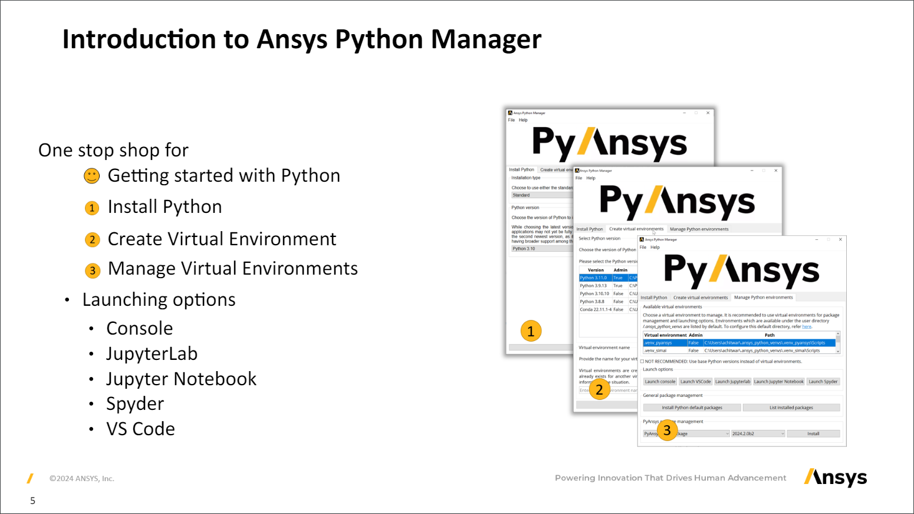

>© 2024 ANSYS, Inc. Unauthorized use, distribution, or duplication is prohibited.

# Ansys Python Manager Content for PyCon India 2024
   
This repository contains presentation on Ansys Python Manager and a [demo video](https://github.com/ansys/pycon-india-2024/discussions/2#discussioncomment-9437150) for [PyCon India 2024](https://in.pycon.org/2024/). 

The Ansys Python Manager is a collaborative open-source project developed by Ansys. 


### View the Presentation

Visit [presentation.pdf](https://ansys.github.io/pycon-india-2024/presentation.pdf)) to see the full generated presentation.

[](https://ansys.github.io/pycon-india-2024/presentation.pdf)


## Engineer new solutions to automate, manage, and extend the power of simulation workflows. 
For more information and resources, visit the [Ansys Developer Portal](https://developer.ansys.com).  


## Build the Presentation Yourself  
  
This template requires LuaTeX due to the use of TTF fonts.  
  
### Installation  
  
#### Linux (Debian)  
  
```bash  
sudo apt update  
sudo apt install -y latexmk texlive-luatex texlive-fonts-extra  
```

On Windows, use a distribution like [MiKTeX](http://miktex.org/). See [Get LaTeX](https://www.latex-project.org/get/).


### Build

Clone this repository with:
```
git clone https://github.com/ansys/pycon-india-2024.git
cd pycon-india-2024
```

Build the presentation using one of the following methods:
Run the following command:

```
latexmk -pdflatex=lualatex -pdf *.tex -interaction=nonstopmode -outdir=./build --shell-escape
```

Or simply:
```
make
```

This will output `presentation.pdf` in the `build` directory.

### Comments or Suggestions  
  
If you have any comments or suggestions regarding this presentation, please feel free to open an issue.  
  
